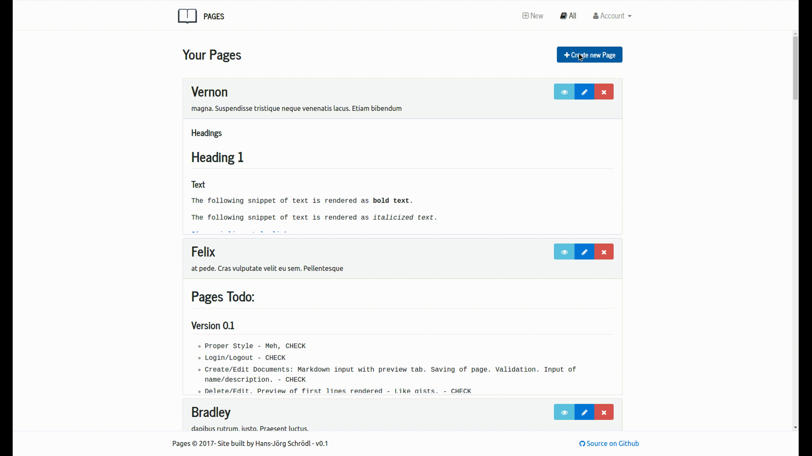

# Pages 

Pages is a simple markdown editor. It was built using [JHipster](https://jhipster.github.io) and a bit of Kotlin.  

## Running Pages

Before you can build Pages, you must install `yarn` and `gradle` on your machine. 

Instal the front-end dependencies by running 

    yarn install

Run the following commands in two separate terminals to run the application. Thanks to the groundwork laid be JHipster your browser will update with any changes you make to the application. 

    ./gradlew
    yarn start

## Contributing

This project is still very much in progress. Nevertheless, contributions are always welcome :smile_cat:
